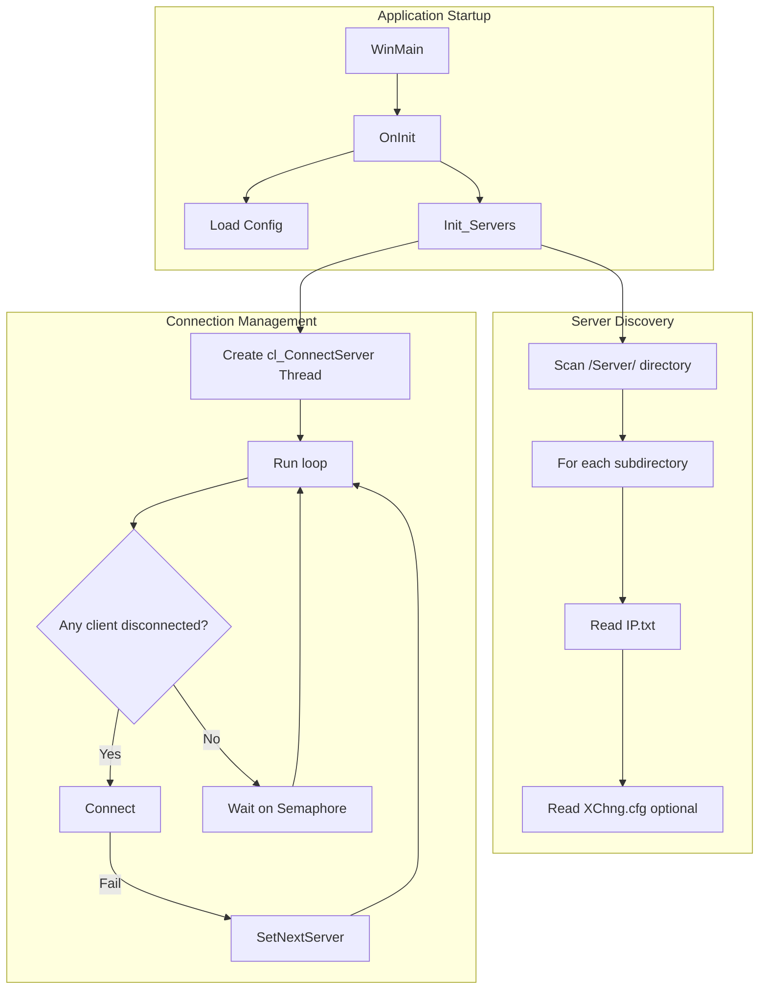
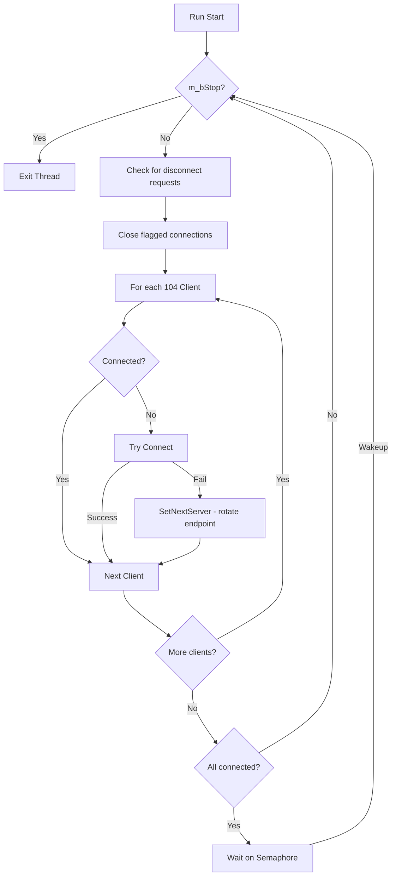
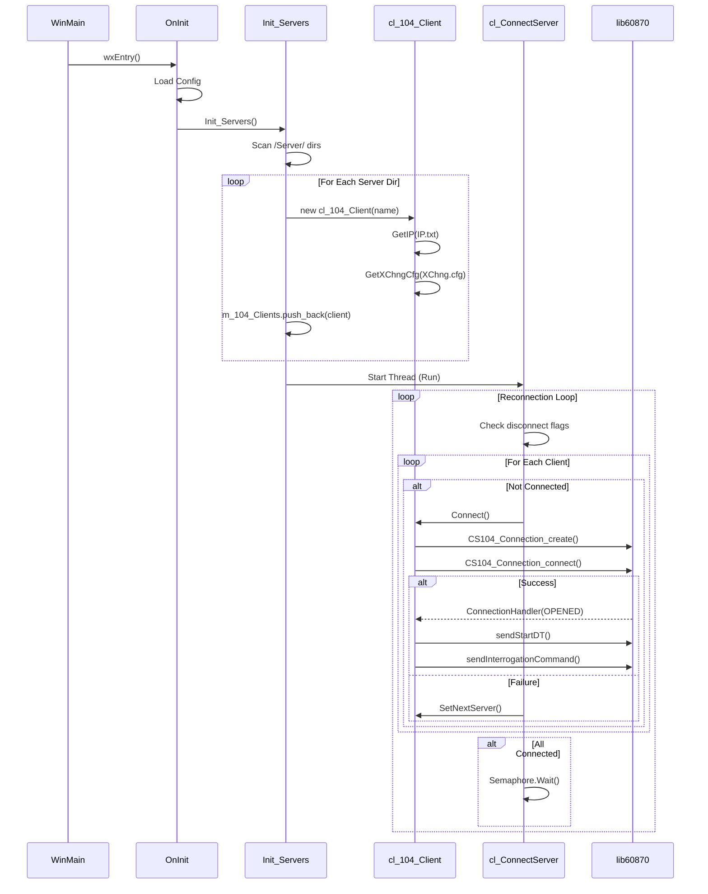

# IEC104 Startup & Connection Management Analysis

Deep-dive analysis of the IEC104 client startup phase, configuration loading, and connection management.

---

## Executive Summary

The application is an **IEC 60870-5-104 Master (Client)** that connects to one or more SCADA servers (104 Slaves) using the **lib60870** library. It supports:
- **Multiple servers** - loaded from subdirectories, each representing a separate server
- **Multiple redundant endpoints per server** - loaded from `IP.txt` file (failover list)
- **Automatic reconnection** - managed by a dedicated `cl_ConnectServer` thread
- **Only one active connection per server** at any time (round-robin failover)

---

## Architecture Overview



---

## 1. Entry Point & Initialization

### 1.1 Application Start Flow

| Step | Function | File:Line | Description |
|------|----------|-----------|-------------|
| 1 | `WinMain` | [main.cpp:L49-L81](file:///c:/_EGC/dncors_iec104/main.cpp#L49-L81) | Entry point, checks for `--svc` flag |
| 2 | `cl_MainApp::OnInit` | [main.cpp:L93-L229](file:///c:/_EGC/dncors_iec104/main.cpp#L93-L229) | Main initialization |
| 3 | `cl_Config::Open/Read` | [main.cpp:L687-L783](file:///c:/_EGC/dncors_iec104/main.cpp#L687-L783) | Load configuration from INI file |
| 4 | `Init_Servers` | [main.cpp:L504-L576](file:///c:/_EGC/dncors_iec104/main.cpp#L504-L576) | Discover and create 104 clients |

### 1.2 Configuration Loading

Configuration is loaded from `DNCors_IEC104.ini` file (defined by `CONFIG_FILE_NAME`):

```ini
[Config]
Log_File=C:/path/to/log.txt
Log_Level=2
ReplayMode=0              ; 1 = replay mode, 0 = live mode
ASDU_Dbg=0                ; ASDU debug verbosity

[Data]
Log=1                     ; Enable data logging
Dir=C:/path/to/data_dir   ; Data log directory
```

> [!NOTE]
> Server IP configuration is **NOT in the main INI file**. Each server has its own subdirectory under `/Server/`.

---

## 2. Server Discovery & Configuration

### 2.1 Directory-Based Server Discovery

Servers are discovered by scanning the `[ExePath]/Server/` directory:

```
[ExePath]/
└── Server/
    ├── ServerA/            ← Each subdir = one cl_104_Client
    │   ├── IP.txt          ← Required: list of server endpoints
    │   └── XChng.cfg       ← Optional: exchange configuration
    ├── ServerB/
    │   ├── IP.txt
    │   └── XChng.cfg
    └── ...
```

**Reference:** [Init_Servers](file:///c:/_EGC/dncors_iec104/main.cpp#L504-L576)

### 2.2 IP.txt Format (Server Endpoints)

Each line in `IP.txt` defines a failover endpoint:

```
192.168.1.100:2404
192.168.1.101:2404
10.0.0.50               # Port defaults to 2404 if omitted
```

**Parsing logic:** [cl_104_Client::GetIP](file:///c:/_EGC/dncors_iec104/cl_104_Client.cpp#L87-L137)

| Field | Format | Default | Example |
|-------|--------|---------|---------|
| IP Address | `xxx.xxx.xxx.xxx` | - | `192.168.1.100` |
| Port | `:nnnnn` | `2404` | `:2405` |

Lines starting with `//` or `#` are comments. Empty lines are skipped.

**Storage:**
```cpp
std::vector<wxIPV4address> m_Server_Addr;  // All endpoints
int m_nAct_Srv_Index;                       // Current active index
```

### 2.3 Multi-Server Support

> [!IMPORTANT]
> **YES**, the app supports multiple servers. Each subdirectory in `/Server/` creates a separate `cl_104_Client` instance.

```cpp
std::list<cl_104_Client_UPtr> m_104_Clients;  // main.h:L100
```

Each `cl_104_Client` manages:
- Its own connection (`m_104_Connection`)
- Its own list of failover endpoints (`m_Server_Addr`)
- Its own elements (`m_Elements`)

> [!WARNING]  
> **However**, only **ONE endpoint per server** is active at a time. Multiple endpoints in `IP.txt` are for **failover**, not simultaneous connections.

---

## 3. Connection Management

### 3.1 Connection State

```cpp
class cl_104_Client {
    CS104_Connection    m_104_Connection;   // lib60870 connection handle
    bool                m_bConnected;       // Connection state
    bool                m_bDisConnect;      // Disconnect request flag
    int                 m_nAct_Srv_Index;   // Active server index in failover list
};
```

### 3.2 cl_ConnectServer Thread (Reconnection Manager)

**Reference:** [cl_ConnectServer::Run](file:///c:/_EGC/dncors_iec104/cl_104_Client.cpp#L1387-L1434)

The reconnection thread runs continuously:



**Key behaviors:**
1. **Automatic reconnection** - Continuously tries to connect disconnected clients
2. **Failover rotation** - On connection failure, moves to next endpoint via `SetNextServer()`
3. **Semaphore blocking** - Sleeps when all clients are connected, wakes on disconnect event

### 3.3 Connect Function

**Reference:** [cl_104_Client::Connect](file:///c:/_EGC/dncors_iec104/cl_104_Client.cpp#L34-L65)

```cpp
bool cl_104_Client::Connect()
{
    // 1. Get current endpoint from failover list
    wxString szIP = m_Server_Addr[m_nAct_Srv_Index].IPAddress();
    int nPort = m_Server_Addr[m_nAct_Srv_Index].Service();
    
    // 2. Destroy previous connection if exists
    if (m_104_Connection != nullptr)
        CS104_Connection_destroy(m_104_Connection);
    
    // 3. Create new lib60870 connection
    m_104_Connection = CS104_Connection_create(szIP, nPort);
    
    // 4. Set callbacks
    CS104_Connection_setConnectionHandler(m_104_Connection, ConnectionHandler, this);
    CS104_Connection_setASDUReceivedHandler(m_104_Connection, ASDU_ReceivedHandler, this);
    
    // 5. Attempt connection (blocking)
    m_bConnected = CS104_Connection_connect(m_104_Connection);
    
    return m_bConnected;
}
```

### 3.4 Server Failover (Round-Robin)

**Reference:** [cl_104_Client::SetNextServer](file:///c:/_EGC/dncors_iec104/cl_104_Client.cpp#L80-L85)

```cpp
void cl_104_Client::SetNextServer()
{
    m_nAct_Srv_Index++;
    if (m_nAct_Srv_Index >= (int)m_Server_Addr.size())
        m_nAct_Srv_Index = 0;  // Wrap around to first endpoint
}
```

This creates a **round-robin** failover: `Server1 → Server2 → Server3 → Server1 → ...`

---

## 4. Connection Events & Handlers

### 4.1 ConnectionHandler Callback

**Reference:** [cl_104_Client::ConnectionHandler](file:///c:/_EGC/dncors_iec104/cl_104_Client.cpp#L302-L349)

| Event | Action |
|-------|--------|
| `CS104_CONNECTION_OPENED` | Set `m_bConnected=true`, send STARTDT, send Interrogation command |
| `CS104_CONNECTION_CLOSED` | Log disconnect, call `CloseConnection()`, notify parent |
| `CS104_CONNECTION_STARTDT_CON_RECEIVED` | Log only |
| `CS104_CONNECTION_STOPDT_CON_RECEIVED` | Log only |

**On successful connection:**
```cpp
CS104_Connection_sendStartDT(connection);
CS104_Connection_sendInterrogationCommand(connection, CS101_COT_ACTIVATION, 0xFFFF, IEC60870_QOI_STATION);
```

### 4.2 CloseConnection

**Reference:** [cl_104_Client::CloseConnection](file:///c:/_EGC/dncors_iec104/cl_104_Client.cpp#L67-L78)

```cpp
void cl_104_Client::CloseConnection()
{
    if (!m_bConnected)
        return;
    
    m_bDisConnect = true;  // Signal disconnect request
    m_pParent->m_Connect_104Srv.m_Semaphore.Post();  // Wake reconnection thread
}
```

> [!NOTE]
> Actual socket close happens in `cl_ConnectServer::Run()` - it detects `m_bDisConnect` flag and calls:
> - `CS104_Connection_close()`
> - `CS104_Connection_destroy()`

---

## 5. Key Data Structures

### 5.1 cl_104_Client Members (Connection Related)

| Member | Type | Purpose |
|--------|------|---------|
| `m_104_Connection` | `CS104_Connection` | lib60870 connection handle |
| `m_bConnected` | `bool` | Connection state |
| `m_bDisConnect` | `bool` | Disconnect request flag |
| `m_Server_Addr` | `vector<wxIPV4address>` | Failover endpoint list |
| `m_nAct_Srv_Index` | `int` | Current endpoint index |
| `m_szName` | `wxString` | Server name (directory name) |

### 5.2 cl_ConnectServer Members

| Member | Type | Purpose |
|--------|------|---------|
| `m_pParent` | `cl_MainApp*` | Parent app reference |
| `m_bStop` | `bool` | Thread stop flag |
| `m_Semaphore` | `wxSemaphore` | Sleep/wake control |

---

## 6. Sequence Diagram - Full Startup



---

## 7. Summary of Answers

| Question | Answer |
|----------|--------|
| **Where is configuration loaded?** | INI file in exe path + subdirectories under `/Server/` |
| **Where are server IPs configured?** | `/Server/[name]/IP.txt` - one endpoint per line |
| **Where is connection opened?** | `cl_104_Client::Connect()` ([L34-65](file:///c:/_EGC/dncors_iec104/cl_104_Client.cpp#L34-L65)) |
| **Is there automatic reconnection?** | **YES** - `cl_ConnectServer::Run()` thread continuously monitors and reconnects |
| **Multi-server support?** | **YES** - each subdirectory = separate server/client instance |
| **Simultaneous multi-endpoint?** | **NO** - only one endpoint active per server (failover list) |
